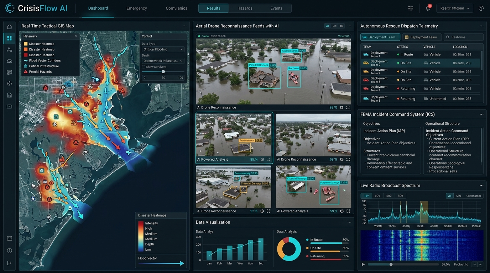
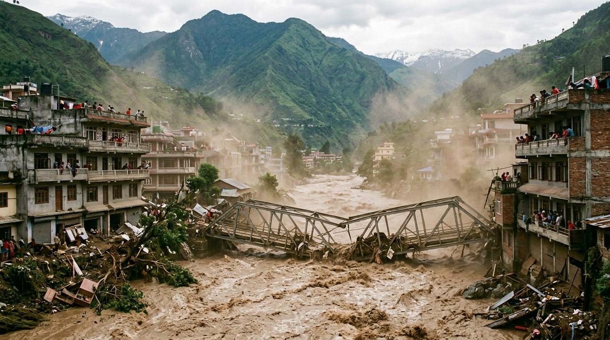
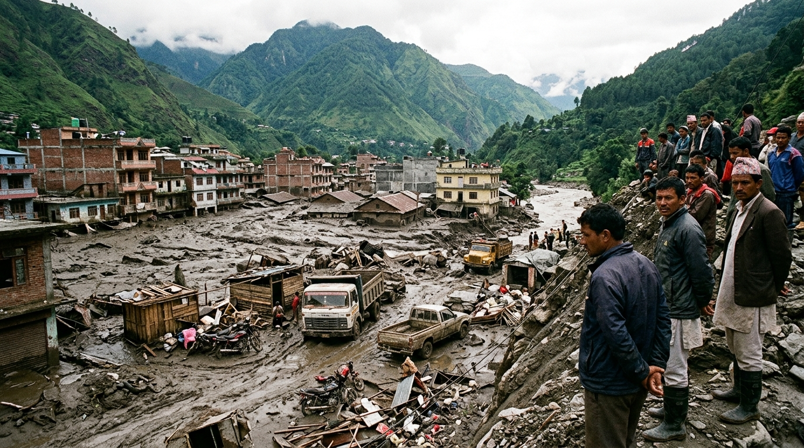
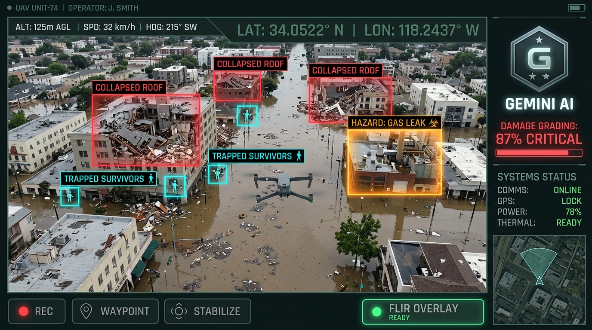
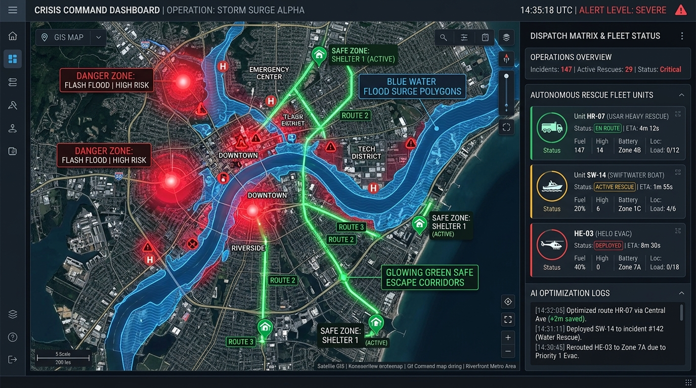

# 🌐 CrisisFlow AI
### Autonomous Disaster Relief Intelligence & Multimodal Crisis Logistics Grid

<div align="center">



[](https://ai.studio)
[](https://ai.google.dev/)
[](https://react.dev/)
[](https://www.typescriptlang.org/)
[](https://opensource.org/licenses/MIT)

**CrisisFlow AI** is a real-time, mission-critical emergency command and disaster relief platform. By uniting **Gemini 3.7 Multimodal Vision**, **tactical GIS spatial layers**, **autonomous rescue unit dispatch optimization**, **FEMA Incident Action Planning (ICS-201/202)**, and **multilingual speech broadcasting**, CrisisFlow AI reduces critical emergency response latency from hours to seconds.

### 🔴 [**Access Live Application Demo**](https://ais-pre-rcut2pmv7lymbxndwqribe-305446503352.asia-southeast1.run.app)
**Live Cloud Run Deployment URL:** `https://ais-pre-rcut2pmv7lymbxndwqribe-305446503352.asia-southeast1.run.app`

[Live Demo](#-live-demo--preview) • [Key Features](#-core-capabilities) • [System Architecture](#-system-architecture) • [AI Pipeline](#-multimodal-ai-pipeline) • [Quick Start](#-quick-start)

</div>

---

## 🔗 Live Demo & Deployment

| Environment | Access Link | Description |
| :--- | :--- | :--- |
| **Public Live Demo** | [**Launch CrisisFlow AI App**](https://ais-pre-rcut2pmv7lymbxndwqribe-305446503352.asia-southeast1.run.app) | Public evaluation deployment for hackathon judges & community testing |
| **Interactive Capabilities** | Full Multimodal AI, Tactical GIS, Speech Synthesis | Zero-setup required in browser |

---

## 📸 Real-World Disaster Field Feeds & Interface Showcase

### 1. Real-World Field Reconnaissance: Nepal Mountain Flash Flood
Torrential flood surge carrying heavy silt, debris, and structural damage through an urban valley settlement. Ingested into CrisisFlow AI for automated inundation contouring and bridge stability scoring.



---

### 2. Ground Reconnaissance: Post-Flood Landslide & Mud Sediment Aftermath
Severe sediment deposition submerging ground floors and trapping vehicles. Ingested into Gemini 3.7 Vision for casualty estimation and heavy extrication requirements.



---

### 3. Multimodal Vision & Drone Telemetry Triage HUD
Analyze high-resolution drone photos, infrared FLIR thermal captures, and field reconnaissance to grade structural collapse and detect trapped survivors in real time.



---

### 4. Autonomous Rescue Dispatch & Tactical GIS Grid
Autonomous capability matching algorithm that dispatches USAR Heavy Extrication, Swiftwater Rescue Boats, and Helo Air-Evac while routing around active flood waters and fire perimeters.



---

## ⚡ Problem Statement & Solution

| The Emergency Response Challenge | How CrisisFlow AI Solves It |
| :--- | :--- |
| **Information Fog of War**: Eyewitness calls and disjointed drone feeds take hours to review and categorize manually. | **Sub-Second Multimodal Triage**: Ingests raw drone and field photos to instantly grade structural collapse percentage (0–100%), detect victim count, and classify threat vectors using Gemini 3.7. |
| **Suboptimal Fleet Routing**: Dispatchers manually balance unit capabilities, risking slow responses or sending wrong assets into blocked roads. | **AI-Optimized Capability Matrix**: Automatically scores unit suitability (boat vs. helo vs. heavy extrication), calculates ETAs, and reserves escape corridors. |
| **FEMA Compliance Burden**: Drafting official FEMA ICS-201/202 documentation takes hours of administrative overhead during active crises. | **Automated IAP Formulator**: Generates compliant incident command action plans with command hierarchy, objectives, and air support branches in one click. |
| **Language Barriers in Alerts**: Evacuation orders fail to reach non-native speakers in high-risk zones. | **Multilingual Voice Broadcasting**: Translates emergency EAS alerts into 8+ languages with Web Speech voice synthesis for instant radio playback. |

---

## 🌟 Core Capabilities

### 🛰️ 1. Tactical GIS Command Grid
- **Real-Time Spatial Grid**: Interactive command map plotting critical incident pins, active radius sweeps, and operational sectors.
- **Dynamic Environmental Overlays**: Toggleable GIS layers for **Flood Surge Vectors**, **FLIR Thermal Wildfire Plumes**, **Wind Corridors**, and **Infrastructure Safe Corridors**.
- **Incident Inspector**: Real-time drilldown into casualty severity, structural integrity metrics, and assigned rescue fleets.

### 🛩️ 2. AI Drone Telemetry & Multimodal Triage HUD
- **Pixel-Level Damage Grading**: Direct Base64 image ingestion to **Gemini 3.7 Flash** with structured schema extraction.
- **Sensor Modes**:
  - **Optical Mode**: True-color reconnaissance.
  - **FLIR Thermal Inversion**: Detects thermal hotspots and living body heat signatures through smoke and rubble.
  - **Edge Fracture Grid**: Computer vision overlay identifying structural shear points and wall fractures.
- **Detection Overlays**: Real-time bounding boxes highlighting collapse zones, hazmat gas plumes, and survivor pockets.
- **1-Click Grid Injection**: Push analyzed reconnaissance directly onto the live operational GIS map.

### 🚑 3. Autonomous Rescue Dispatch Matrix
- **Capability Matching Engine**: Dynamic matching between incident priorities (`P1-CRITICAL`, `P2-HIGH`, `P3-MODERATE`) and specialized units (`USAR Heavy Extrication`, `Swiftwater Boat`, `Helo Air-Evac`, `Hazmat Containment`).
- **Fleet State Machine**: Real-time state transitions (`AVAILABLE` → `DISPATCHED` → `EN_ROUTE` → `ON_SCENE` → `RESOLVED`) with live ETA tracking.

### 📢 4. Multilingual Emergency Broadcast & Voice Synthesis
- **Multi-Channel Distribution**: Generates optimized messages for SMS, Mega-Siren, EAS Radio Broadcasts, and Civic Social Feeds.
- **8+ Languages Supported**: English, Spanish, Mandarin, Vietnamese, Tagalog, Arabic, French, and Japanese.
- **Audio Radio Synthesis**: Client-side Web Speech API playback engine delivering synthesized radio dispatches.

### 📋 5. FEMA ICS Incident Action Plan (IAP) Engine
- **FEMA ICS-201 / ICS-202 Compliance**: Generates complete Incident Briefings, Command Objectives, Weather Factors, Safety Messages, and Air Support Divisions.
- **Export & Print**: Clean, print-ready layout for emergency command staff distribution.

---

## 🏗️ System Architecture

```
┌─────────────────────────────────────────────────────────────────────────┐
│                        CRISISFLOW AI DASHBOARD                          │
│     (React 18 + TypeScript + Tailwind CSS + Lucide Icons + Motion)      │
├───────────────┬─────────────────────────┬───────────────────────────────┤
│ Tactical GIS  │  Multimodal Drone HUD   │   Autonomous Dispatch Matrix  │
│ Command Grid  │  • Optical / FLIR / Edge│   • Capability Matcher        │
│ • Mapbox/GIS  │  • Damage Estimator     │   • Fleet Status Machine      │
│ • Hazard Lyr  │  • Bounding Box Engine  │   • ETA Route Minimizer       │
├───────────────┴─────────────────────────┴───────────────────────────────┤
│          FEMA ICS-201/202 Formulator & Multilingual EAS Broadcast       │
└────────────────────────────────────┬────────────────────────────────────┘
                                     │ (Secure API Proxy)
                                     ▼
┌─────────────────────────────────────────────────────────────────────────┐
│                       EXPRESS NODE.JS BACKEND                           │
│                      (server.ts / server/gemini.ts)                     │
├─────────────────────────────────────────────────────────────────────────┤
│ • /api/triage/analyze    ──► High-Resolution Multimodal Base64 Image    │
│ • /api/dispatch/optimize ──► Priority & Unit Capability Optimization    │
│ • /api/iap/generate      ──► Structured FEMA ICS-201/202 Formulation    │
│ • /api/broadcast/generate──► Multi-Channel Multilingual EAS Translation │
└────────────────────────────────────┬────────────────────────────────────┘
                                     │
                                     ▼
┌─────────────────────────────────────────────────────────────────────────┐
│                  GOOGLE GEMINI 3.7 MULTIMODAL API                       │
│    (gemini-3.7-flash • gemini-flash-latest • gemini-3.1-pro-preview)    │
│                                                                         │
│  • Multimodal Vision Comprehension   • Structured JSON Type Schema      │
│  • Reasoning & Latency Fallback      • Zero-Loss Safety Handling        │
└─────────────────────────────────────────────────────────────────────────┘
```

---

## 🧠 Multimodal AI Pipeline

When a drone capture or field photo is uploaded:

```
[Drone Capture / File Upload]
           │
           ▼
[Base64 Encoding & Validation (Up to 25MB)]
           │
           ▼
[Express Server-Side Route (/api/triage/analyze)]
           │
           ▼
[Google Gen AI TypeScript SDK Client]
  ├── System Prompt: Disaster Reconnaissance Specialist
  ├── User Part 1: High-Resolution Inline Image Buffer
  └── User Part 2: Incident Context & Telemetry Coordinates
           │
           ▼
[Structured Response Schema Generation]
  ├── damageGrade (0-100%)
  ├── collapseType (None / Partial / Complete / Hazardous)
  ├── estimatedCasualties (trapped / ambulatory / critical)
  ├── requiredAssets (USAR / Boat / Helo / Hazmat / K9)
  ├── immediateDirectives (15-Minute Action Items)
  └── boundingBoxes ([ymin, xmin, ymax, xmax, label])
```

---

## 🛠️ Tech Stack & Dependencies

- **Frontend**:
  - `react`: ^18.3.1
  - `vite`: Modern build tool and dev server
  - `tailwindcss`: Tactical high-contrast styling
  - `motion/react`: Smooth layout transitions & HUD animations
  - `lucide-react`: Mission-critical tactical iconography
  - `Web Speech API`: Native browser speech synthesis
- **Backend & AI**:
  - `express`: REST API proxy routes
  - `@google/genai`: Official Google Gen AI TypeScript SDK
  - `esbuild`: High-performance production bundling

---

## 🚀 Quick Start

### Prerequisites
- **Node.js**: v18.0.0 or higher
- **npm**: v9.0.0 or higher
- **Google Gemini API Key**: [Get a key from Google AI Studio](https://aistudio.google.com/)

### 1. Clone the Repository
```bash
git clone https://github.com/your-username/crisisflow-ai.git
cd crisisflow-ai
```

### 2. Install Dependencies
```bash
npm install
```

### 3. Setup Environment Variables
Create a `.env` file in the project root:
```env
GEMINI_API_KEY=your_gemini_api_key_here
```

### 4. Start the Application
```bash
# Start local development server
npm run dev
```
Navigate to `http://localhost:3000` to launch the CrisisFlow AI Command Center.

### 5. Production Build
```bash
# Compile client and bundle backend
npm run build

# Start production server
npm start
```

---

<div align="center">
  <sub>Built with ❤️ for disaster responders worldwide using Google AI Studio & Gemini 3.7.</sub>
</div>
